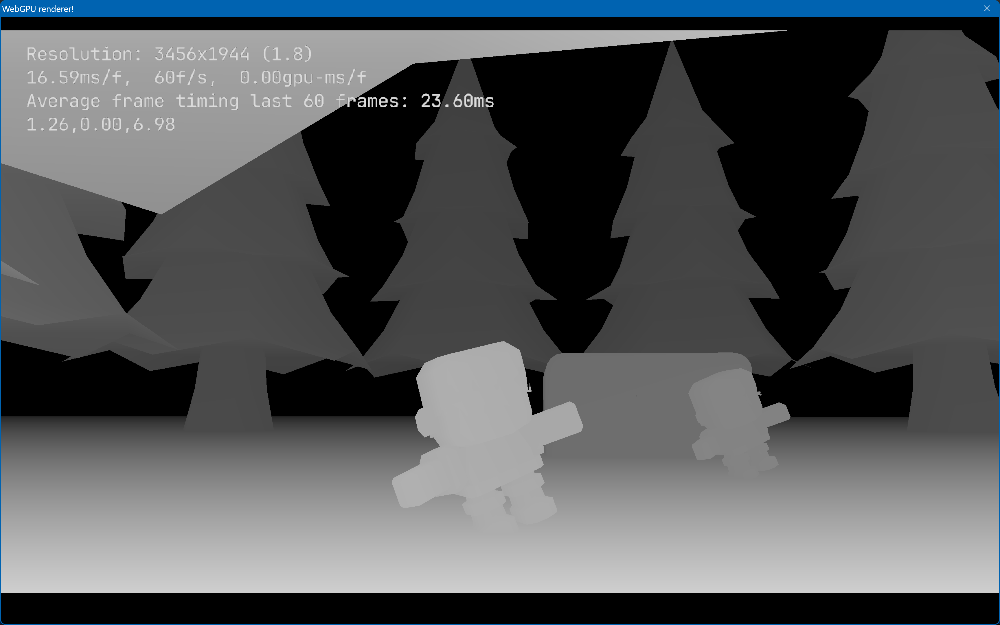
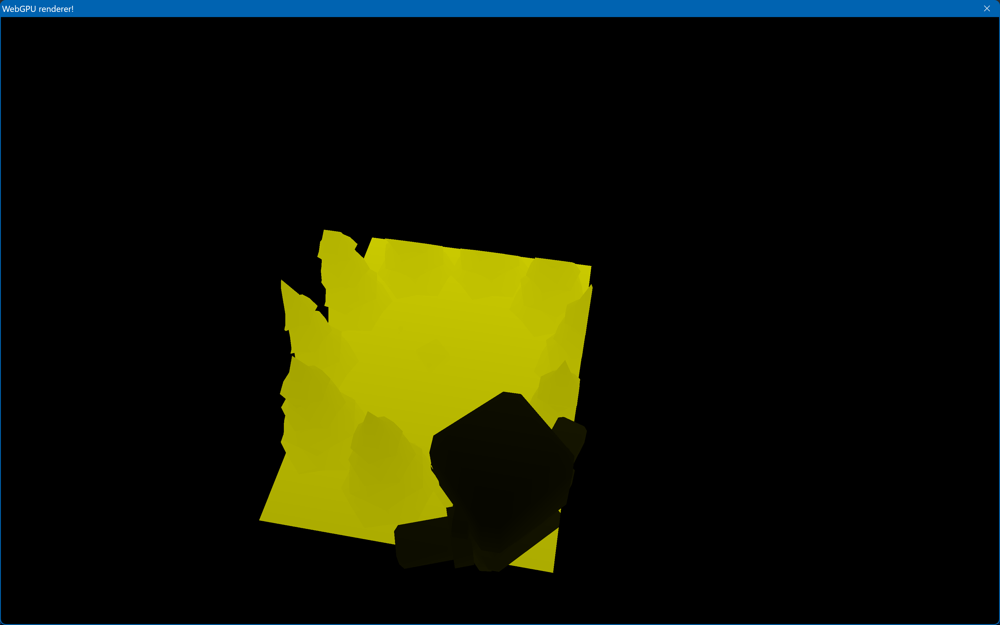

# js types
npm install --save @webgpu/types

# compiling to WASM
make sure that clang does not link with stdlib, doesn't expect a main function, and allows the extern functions
> clang --% --target=wasm32 -Wl,--allow-undefined -nostdlib -Wl,--no-entry -Wl,--export-all -O3 -o main.wasm wasm.c

# compiling with TCC
> tcc webgpu.c -L. -lwgpu_native -shared -rdynamic
> tcc main.c -L. -lwebgpu -run

# compiling with GCC (in powershell with ';' to separate successive commands)
> gcc main.c -L. -lwebgpu; ./a.exe

# basic shadow map implementation

# wireframe view

# depth view

# shadow map extent
